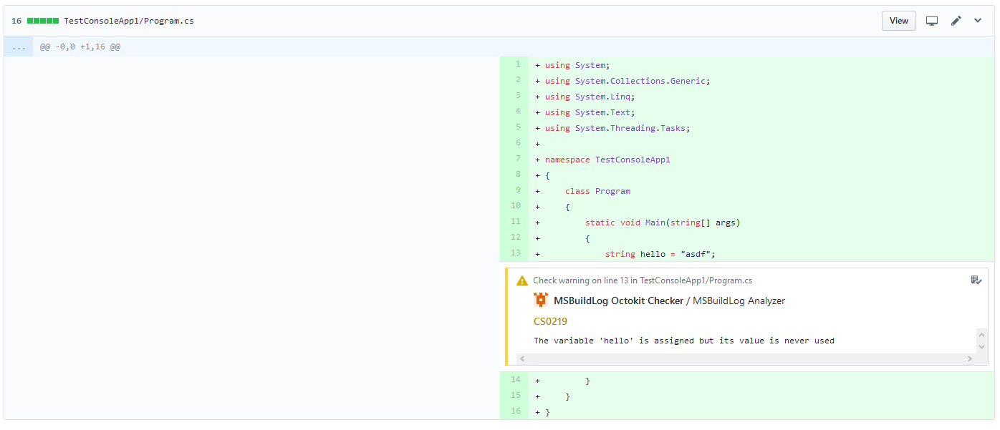
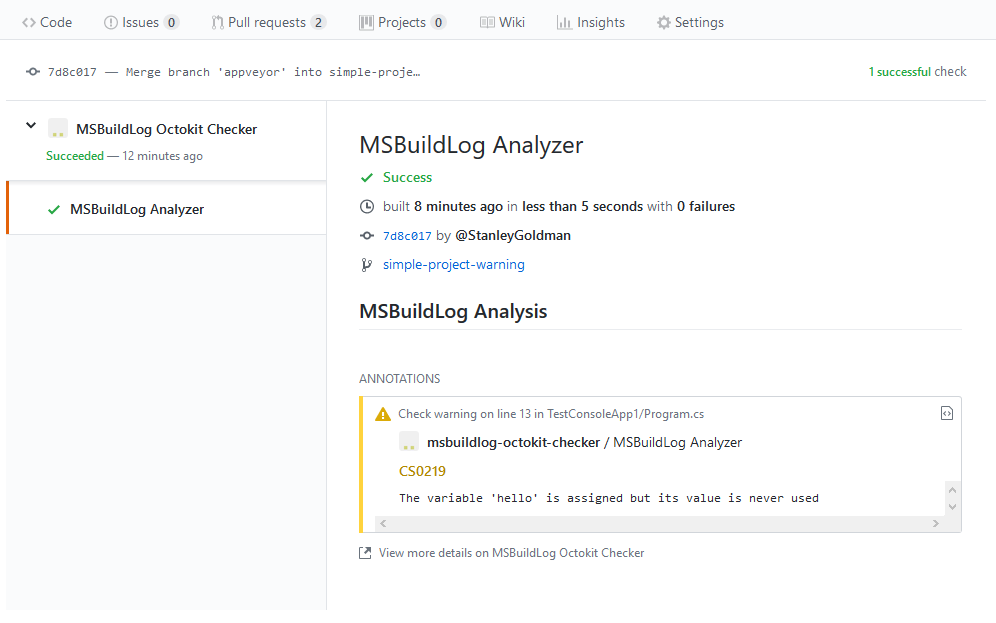

# Build Cross Check

| Projects | Description | Versions |
| :---- | :---- | :---- |
| [**BCC-Submission**](http://github.com/justaprogrammer/BCC-Submission) | Submit data to **Build Cross Check** |   |
| [**BCC-MSBuildLog**](http://github.com/justaprogrammer/BCC-MSBuildLog) | Create data for **Build Cross Check** from MSBuild binary logs |   |

## Overview
Build Cross Check is a GitHub App and set of tools to create [Checks](https://developer.github.com/v3/checks/) in GitHub.

## Getting started

The authors of BuildCrossCheck maintain a hosted version of the source code you see here.
Install it by adding the GitHub App: [github.com/apps/build-cross-check](https://github.com/apps/build-cross-check) to your repositories and following the [integration documentation](docs/integrating.md). 

## Documentation
You can find the documentation [here](docs/readme.md).

## Licenses
- This source is distributed under under the AGPL.

## More information
- [Build Cross Check GitHub App](https://github.com/apps/build-cross-check)
- [GitHub Checks API](https://developer.github.com/v3/checks/)

## Questions?

Please [file an issue](https://github.com/justaprogrammer/BuildCrossCheck/issues/new/choose)! If you'd prefer to reach out in private, please send an email to Stanley.Goldman@gmail.com.
